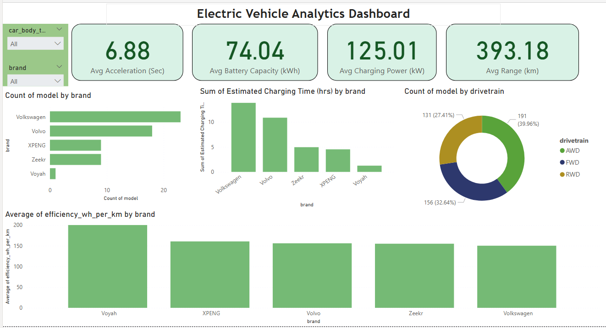

readme_content = """# 🚗 Electric Vehicle Analytics Dashboard

📊 An interactive **Power BI dashboard** analyzing Electric Vehicle (EV) performance, efficiency, battery capacity, charging power, and range.  

---

## 🔑 Key Insights
- ⚡ **Avg Acceleration**: 6.88 Sec  
- 🔋 **Avg Battery Capacity**: 74.04 kWh  
- ⚡ **Avg Charging Power**: 125.01 kW  
- 🚘 **Avg Range**: 393.18 km  

---

## 📷 Dashboard Preview

---

## 📂 Project Files
- `ev_Report.pbix` → Full Power BI dashboard file  
- `Ev_Dashboard.PNG` → Dashboard preview image  

---

## 📌 Features
- Count of EV models by **brand**  
- Estimated charging time by **brand**  
- Average efficiency (Wh/km) comparison  
- Distribution of EVs by **drivetrain** (AWD, FWD, RWD)  
- KPI cards for quick overview of performance  

---

## ⚙️ Tools Used
- **Power BI Desktop**  
- **DAX** for calculated measures  
- Dataset containing EV specifications (battery, efficiency, charging, drivetrain, etc.)  

---

## 🚀 How to Use
1. Clone this repository or download the `.pbix` file.  
2. Open with **Power BI Desktop**.  
3. Explore and interact with the dashboard visuals.  

